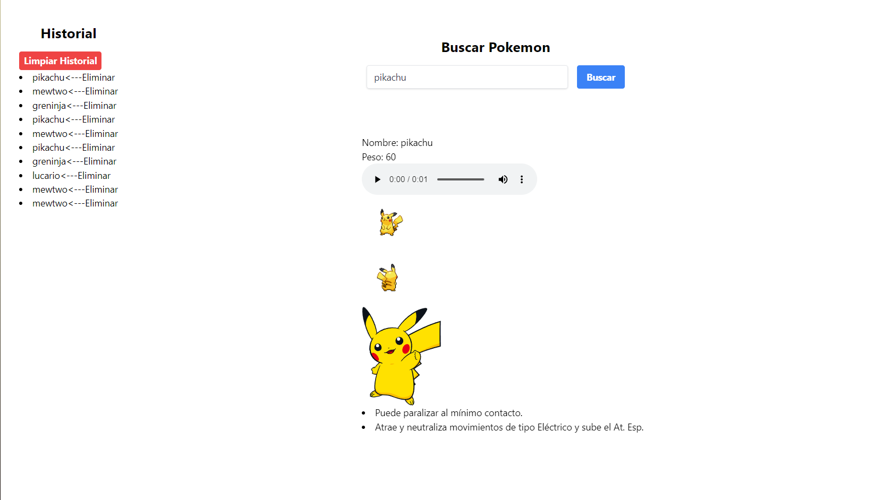

# Aplicación Web de Búsqueda de Pokémon

Esta aplicación web permite a los usuarios buscar Pokémon y ver su información en español. Utiliza la PokeAPI para obtener datos de Pokémon y proporciona una interfaz fácil de usar para buscar y mostrar resultados.

##  Reto: Desarrollo de una WebApp de Búsqueda de Pokémon

## Descripción
Desarrollar una webapp simple que permita a los usuarios buscar Pokémon y mostrar los nombres de sus habilidades en español. Además, se debe almacenar un historial de búsqueda en una base de datos y mostrar las últimas 10 búsquedas exitosas. Es importante diferenciar entre sesiones, de modo que cada navegador tenga su propio historial de búsqueda.

## Tecnologías Utilizadas
- Laravel Framework (v9)
- API de Pokémon: https://pokeapi.co/
- MySQL Database
- JavaScript para la interacción del frontend

## Requisitos y Funcionalidades
La aplicación debe permitir al usuario ingresar un término de búsqueda.
Debe mostrar el resultado obtenido de la API de Pokémon, incluyendo el nombre del Pokémon y sus habilidades en español.
Se debe guardar un historial de búsqueda en la base de datos.
El historial debe actualizarse dinámicamente sin necesidad de refrescar la página.
Cada usuario debe tener su propio historial de búsqueda, distinto entre sesiones y navegadores.
Los resultados y el historial deben mostrarse en una interfaz sencilla, sin necesidad de un diseño elaborado.

## Características

- Buscar Pokémon por nombre.
- Ver información de Pokémon, incluyendo nombre, habilidades e imágenes.
- Mostrar historial de búsquedas.
- Buscar Pokémon y ver información en español.

## Uso

1. **Instalación**

   Clona el repositorio en tu máquina local:

   ```bash
   git clone https://github.com/your-username/pokemon-search-web-app.git
   ```

   Navega hasta el directorio del proyecto:

   ```bash
   cd pokemon-search-web-app
   ```

2. **Configuración**

   Instala las dependencias usando Composer:

   ```bash
   composer install
   ```

   Copia el archivo `.env.example` a `.env` y configura la información de tu base de datos:

   ```bash
   cp .env.example .env
   ```

   Genera una nueva clave de aplicación:

   ```bash
   php artisan key:generate
   ```

   Ejecuta las migraciones de la base de datos para crear las tablas necesarias:

   ```bash
   php artisan migrate
   ```

3. **Iniciar el Servidor**

   Inicia el servidor de desarrollo de Laravel:

   ```bash
   php artisan serve
   ```

   Accede a la aplicación en tu navegador web en `http://localhost:8000`.

4. **Buscar Pokémon**

   - Ingresa el nombre de un Pokémon en el campo de búsqueda.
   - Haz clic en el botón "Buscar" para obtener información sobre el Pokémon.
   - Verás el nombre del Pokémon, sus habilidades e imágenes.

5. **Ver Información de Pokémon en Español**

   - La aplicación automáticamente obtiene información de Pokémon en español.
   - El nombre del Pokémon, sus habilidades e imágenes se mostrarán en español.

6. **Ver Historial de Búsqueda**

   - La aplicación muestra las últimas 10 consultas de búsqueda.
   - El historial de búsqueda se actualiza dinámicamente sin recargar la página.

## Dependencias

- Framework Laravel
- Cliente HTTP Guzzle
- Tailwind CSS

## Capturas


